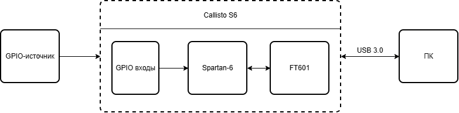
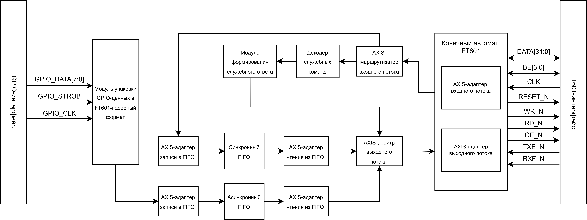
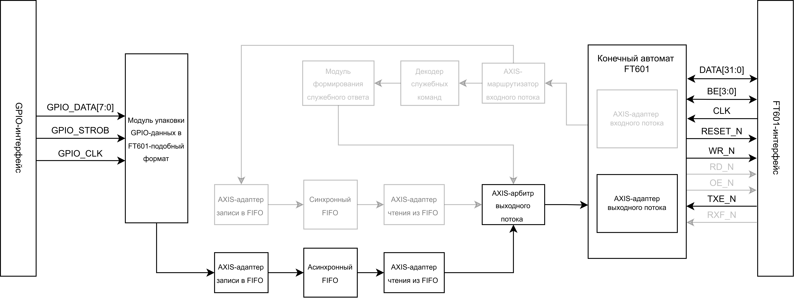
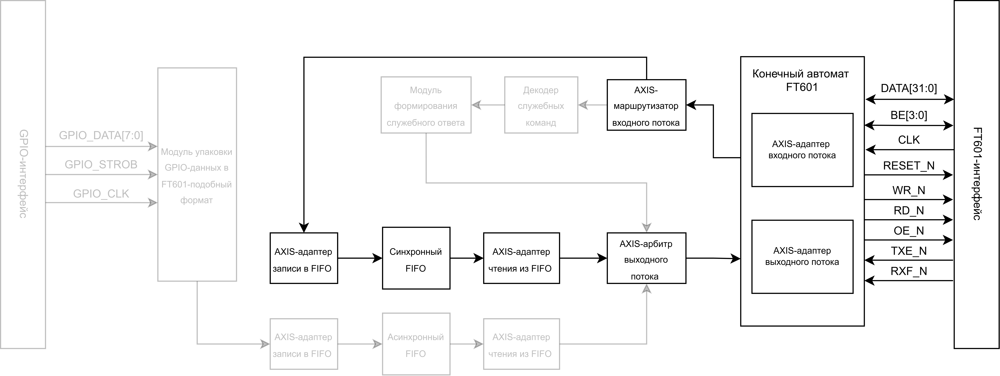
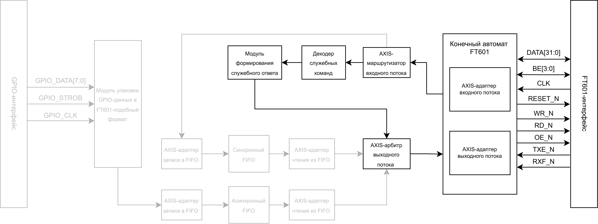
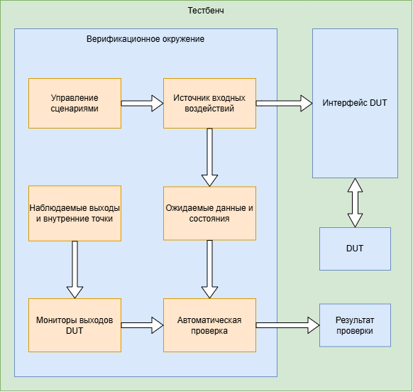

# Система обмена данными FPGA - FT601 - PC

Этот проект реализует высокоскоростной тракт обмена данными между `Xilinx Spartan-6` и ПК через мост `FTDI FT601` в режиме `245 synchronous FIFO`.

Основной поток простой: байты приходят по GPIO, упаковываются в 32-битные слова, проходят через FIFO и уходят в ПК через USB 3.0. `GPIO_STROB` задает валидность каждого байта и дальше превращается в `BE[3:0]` для 32-битного слова. В том же bitstream есть loopback-режим. Он нужен для проверки FT601 и host-side софта без внешнего GPIO-источника: ПК отправляет данные в FPGA, а FPGA возвращает их обратно через тот же FT601.

Проект использует один универсальный bitstream. После reset система стартует в `normal mode`, а режимы переключаются служебными командами с ПК.

## Схемы

Верхнеуровневая схема системы сопряжения:



Структурная схема СФ-блока ПЛИС:



## Как это работает

В `normal mode` полезные данные идут по цепочке:



GPIO-домен и FT601-домен разделены асинхронным FIFO. GPIO-интерфейс остается односторонним: внешнего `ready` назад к GPIO-источнику нет. Граница stream-тракта начинается внутри СФ-блока после упаковки байтов. `packer8to32` собирает четыре позиции GPIO в `data[31:0]`, а `keep[3:0]` формирует из `GPIO_STROB`; этот `keep` затем идет как `BE[3:0]`. Write-side adapter пишет упакованные слова в FIFO, а read-side adapter выдает стабильный `valid/ready/data/keep` поток в TX arbiter. В `normal mode` FT601 RX path используется для служебных команд.

В `loopback mode` источник данных меняется:



Loopback FIFO хранит не только `DATA[31:0]`, но и `BE[3:0]`, поэтому payload возвращается с тем же byte-enable mask. Service frame при этом не попадает в payload.

Третий поток - status response. Он формируется внутри FPGA по команде `CMD_GET_STATUS` и имеет приоритет над normal/loopback payload. Это важно: `STATUS_MAGIC` и `status_word` должны выйти подряд, без вклинивания пользовательских данных.



Если status запрошен рядом с активным payload-потоком, RTL останавливает дальнейшее чтение payload FIFO на время service-read фазы. Payload снова разрешается только после того, как FT601 деактивирует `TXE_N`, то есть host-side чтение status frame завершилось. Уже лежащие в USB endpoint старые payload-слова не исчезают, поэтому `ft601_test` при чтении статуса ищет `STATUS_MAGIC` с ограниченным пропуском stale-слов.

## Service protocol

Служебный протокол идет поверх обычных 32-битных слов FT601. Отдельный control endpoint не используется.

Команда состоит из двух слов по `EP02`:

```text
CMD_MAGIC = 0xA55A5AA5
opcode
```

Ответ на `CMD_GET_STATUS` тоже состоит из двух слов, но читается из `EP82`:

```text
STATUS_MAGIC = 0x5AA55AA5
status_word
```

Для service/status слов ожидается полное 32-битное слово, то есть `BE = 4'hF`. Для normal payload `BE` повторяет маску валидных GPIO-байтов.

Поддерживаемые команды:

| Opcode | Значение | Назначение |
| --- | --- | --- |
| `CMD_CLR_SERVICE_ERROR` | `0x00000001` | очистить `service_frame_error` |
| `CMD_SET_LOOPBACK` | `0xA5A50004` | перейти в loopback mode |
| `CMD_SET_NORMAL` | `0xA5A50005` | вернуться в normal mode |
| `CMD_GET_STATUS` | `0xA5A50006` | прочитать status frame |
| `CMD_FT601_RESET` | `0xA5A50007` | сформировать `RESET_N=0` для FT601 на два такта `CLK` |

`status_word` содержит текущий режим, `service_frame_error` и empty/full флаги двух FIFO:

| Бит | Поле |
| --- | --- |
| `0` | `loopback_mode` |
| `1` | `service_frame_error` |
| `2` | `tx_fifo_empty` |
| `3` | `tx_fifo_full` |
| `4` | `loopback_fifo_empty` |
| `5` | `loopback_fifo_full` |
| `31:6` | `0` |

## Reset model

`FPGA_RESET` - главный внешний hard reset проекта. Он сбрасывает оба домена FPGA через локальные reset-синхронизаторы и возвращает RTL в исходное состояние. Это единственный reset, который используется внутри модулей ПЛИС.

`RESET_N` - отдельный выход ПЛИС в FT601. В нормальном состоянии он равен `1`. Команда `CMD_FT601_RESET` формирует на нем импульс `0` длительностью два такта `CLK` FT601. Этот импульс сбрасывает только микросхему FT601 и не является сбросом логики ПЛИС: режим, FIFO, FSM, adapters и диагностические флаги не очищаются этой командой.

## Структура репозитория

`source/` содержит RTL, testbench и constraints. Главная точка входа - `source/top.v`. Физическая граница FT601 находится в `ft601_wrapper.v`, а read/write handshake разбит между `ft601_fsm.v`, `ft601_rx_adapter.v` и `ft601_tx_adapter.v`. Выбор TX-источника делает `axis_tx_arbiter.v`, RX service/payload path разделяет `rx_stream_router.v`, команды разбирает `cmd_decoder.v`. FIFO-порты приводятся к stream-контракту через `axis_fifo_write_adapter.v` и `axis_fifo_read_adapter.v`.

`SPECIFICATION.md` содержит актуальное техническое описание протокола, reset-системы, FT601 handshake, datapath и проверок.

`ft601_test/` - консольная C++ утилита для ручной проверки с ПК через D3XX API. Код разделен по смыслу: `main.cpp` содержит меню, `ft601_device.*` работает с D3XX и pipe, `service_protocol.*` отправляет команды и читает статус, `payload_test.*` генерирует raw payload и читает payload dump, `throughput.*` печатает прикладную скорость payload-операций.

## Проверка RTL

Базовая проверка выполняется из `source/`:

```powershell
cd .\source
iverilog -g2005-sv -o testbench.out testbench.v
vvp .\testbench.out
verilator_bin.exe --lint-only --timing testbench.v
```

Для timing-sensitive изменений дополнительно нужен ISE flow и просмотр `top.syr`, `top.twr`, `top.twx`. Проектный timing-контракт не задает фиксированную latency из FTDI master FIFO reference. Требование другое: не должно быть прямого combinational path от `TXE_N/RXF_N` pad к `WR_N/RD_N/OE_N`; handshake должен быть корректным, а `DATA/BE` должны стабильно вести себя во время write, read и reset.

Структурная схема тестбенча:



## Проверка с ПК

Сборка `ft601_test` описана в `ft601_test/README.md`. Команда сборки использует `MSYS2 MinGW x64` и библиотеку D3XX из `WU_FTD3XXLib`.

Минимальный ручной сценарий на железе такой. Сначала прошить FPGA и убедиться, что FT601 настроен в `245 synchronous FIFO mode`. Затем запустить `ft601_test`, прочитать `Get FPGA status`, включить `Set loopback mode`, выполнить `Write test payload` и отдельно включить `Read payload to file`. После этого можно вернуться через `Set normal mode` и при необходимости очистить `service_frame_error` командой `Clear service frame error`.

Raw-операции `Write test payload` и `Read payload to file` являются debug-инструментами. `Write test payload` пишет `64` значения счетчика в `EP02`, каждое значение идет четырьмя байтами: `00 00 00 01`, `00 00 00 02` и далее. В `normal mode` это не echo-тест: normal TX path формируется внешним GPIO-источником. `Read payload to file` включает потоковое чтение raw payload чанками по `256 KiB`, использует D3XX stream pipe, печатает статистику примерно раз в секунду и работает до нажатия `q`. Status frame читается только через `Get FPGA status`.

## Основные точки входа

Для понимания проекта достаточно трех файлов: `source/top.v`, `SPECIFICATION.md` и `ft601_test/README.md`. Для анализа FT601 handshake используются `ft601_wrapper.v`, `ft601_fsm.v`, `ft601_rx_adapter.v`, `ft601_tx_adapter.v` и waveform из `source/testbench.vcd`.
